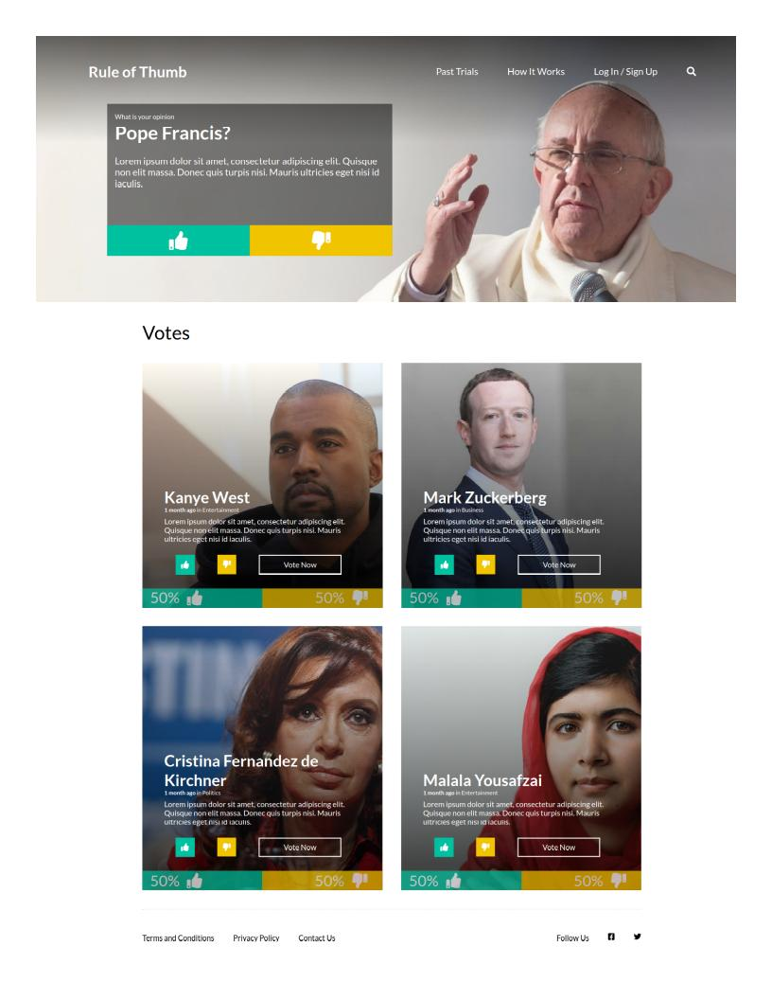

# Rule of Thumb 

> This project is a clone of a provided page in the specifications for the test.

This is a UI test made for Zemoga as part of the candidate process. The objective was to clone the visuals of the provided screen shot and give the site functionality using JS. The framework chosen to build the site was ReactJS. The publicity sections were not added to the clone due to not being part of the functionality of the site and all the efforts went to make the main components of the page look as close as the original.

## Built With

- ReactJS,
- Jest,

## Live Demo

[Test Result Link](https://zemoga-test-mm.netlify.app/)

# How to use it

Just click on the [Live link](https://zemoga-test-mm.netlify.app/) and start testing the application or you can also choose to set it up locally following the next instructions.

## Setup Locally

To run the application locally you will need to follow several steps to make it work.

First, you have to check if you have **nodejs** installed on your machine. For this type the following command in your terminal:

> node -v

If **command not found** shows as a response, then go to [nodejs.org](https://nodejs.org/en/) and follow the instructions to install it. After completing the installation the same command should show you a version number.

Then clone the [repository](https://github.com/mateomh/zemoga-ui-test.git) into your local drive and open a terminal in the root folder of the project and install the necessary packages to make it work by running this command:

> npm install

This will get the project ready to run. After this run the following command to start the development server on **localhost:3000/** and wait for the browser to open:

> npm start

If the browser does not open or you close it by accident, but the server is still running you can type **localhost:3000/** in your address bar to get into the application again.

## Tests

This project has a suite of tests built-in.

To run the tests clone the [repository](https://github.com/mateomh/Pokedex-React.git) into your local drive, if you haven't done so, and open a terminal in the root folder of the project and install the necessary packages to make it work by running this command:

> npm install

Then you can just run the following command and see the results

> npm test

## Author

👤 **Mateo mojica**

- Github: [@mateomh](https://github.com/mateomh)
- Twitter: [@mateo_m_h](https://twitter.com/mateo_m_h)
- Linkedin: [Mateo mojica](https://linkedin.com/mateo_mojica_hernandez)

## 🤝 Contributing

Contributions, issues, and feature requests are welcome!

Feel free to check the [issues page](issues/).

## Show your support

Give a ⭐️ if you like this project!

## Acknowledgments

- Microverse
- Zemoga

## 📝 License

This project is [MIT](https://opensource.org/licenses/MIT) licensed.

## Credits

Credits to all the following people for the photos used in the page:

Pope Francis Photo by <a href="https://www.pbs.org/wgbh/frontline/article/pope-francis-in-his-own-words/">PBS</a>

Kanye West Photo by <a href="https://www.vanityfair.com/people/kanye-west">Vanity Fair</a>

Mark Zuckerberg Photo by <a href="https://realestatemarket.com.mx/influencers/mark-zuckerberg">Real State Market & Lifestyle</a>

Cristina Fernandez de Kirchner Photo by <a href="https://cnnespanol.cnn.com/2018/03/06/cristina-fernandez-kirchner-amia-causas-los-sauces-hotesur-peores-momentos/">CNN en español</a>

Malala Yousafzai Photo by <a href="https://entaconadas.co/malala-yousafzai-joven-con-proposito/">Entaconadas</a>